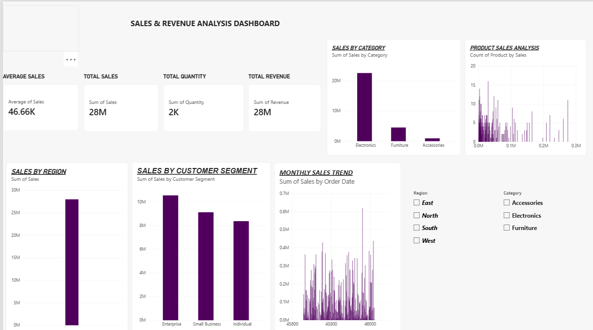

# Sales & Revenue Analysis Dashboard – Power BI

## Thiranex Internship – Task 1

This project was completed as part of my internship at **Thiranex**.

The objective of this task was to create an interactive Sales & Revenue Analysis Dashboard using Microsoft Power BI.

## Dashboard Features

- Total Sales
- Average Sales
- Total Quantity
- Total Revenue
- Sales by Region
- Sales by Customer Segment
- Sales by Category
- Product Sales Analysis
- Sales Trend
- Interactive Region and Category Filters

## Tools Used

- Microsoft Power BI
- Data Analysis
- Data Visualization

## Dashboard Preview

## Project Status

**Completed – Thiranex Internship Task 1**
